# 🛡️ CVPulse: Multi-Agent RAG Resume Analyzer & Career Planner

**Author:** Parth Rana

CVPulse is a production-grade, multi-agent RAG-powered resume analysis application that parses, evaluates, and scores resumes against any custom target job role typed by the user. Powered by a sequential LangGraph pipeline, the application uses local semantic context retrieval (RAG) and Groq-hosted LLMs to deliver comprehensive reviews, shortlist recommendations, phrasing rewrites, tailored interview questions, and career roadmaps.

<p align="center">
  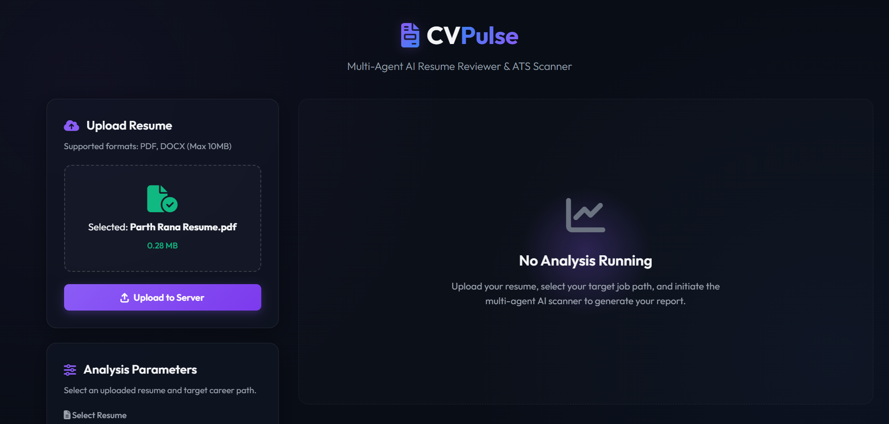
</p>

<p align="center">
  <a href="https://fastapi.tiangolo.com"></a>
  <a href="https://github.com/langchain-ai/langgraph"></a>
  <a href="https://www.trychroma.com"></a>
  <a href="https://groq.com"></a>
  <a href="https://github.com/parthRana26/ai-resume-reviewer/blob/main/LICENSE"></a>
</p>

---

## 📖 Project Overview

### The Problem
Traditional Applicant Tracking Systems (ATS) rely on strict keyword density and simple matching regex. They do not understand the semantic relationships between tools, frameworks, and job descriptions, resulting in highly qualified candidates being filtered out due to syntax mismatches.

### The CVPulse Solution
CVPulse implements an interactive web dashboard coupled with a multi-agent backend. By taking **any target role string** from the user, the app:
1. Parses PDF or DOCX resume structures.
2. Embeds and retrieves the most contextually relevant resume chunks using **RAG** (Retrieval-Augmented Generation).
3. Evaluates structural layout, experience relevancy, skill gaps, and project depth via a sequential **LangGraph** workflow.
4. Generates data-driven phrasing recommendations, candidate risk assessments, and targeted career roadmaps.

---

## 🏗️ Architecture Design

### System Component Architecture
The system separates file processing, metadata storage, and multi-agent coordination across distinct service layers.

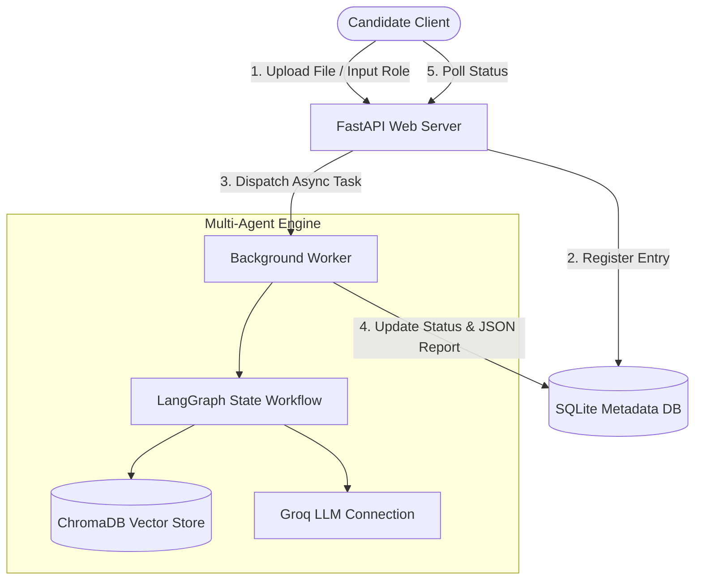

### LangGraph Workflow & State Transitions
The core processing is structured as a sequential graph using a type-safe `ResumeReviewState` dictionary.

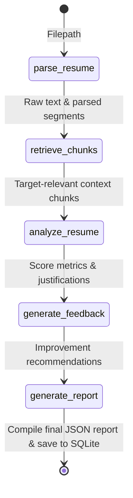

---

## 📸 Demo Walkthrough

### 1. Welcome Screen (`demo/1.png`)
The primary interface state when no analysis task is currently active.
<p align="center">
  
</p>

### 2. Resume File Staging (`demo/2.png`)
The interactive drag-and-drop zone allowing PDF or DOCX file selection.
<p align="center">
  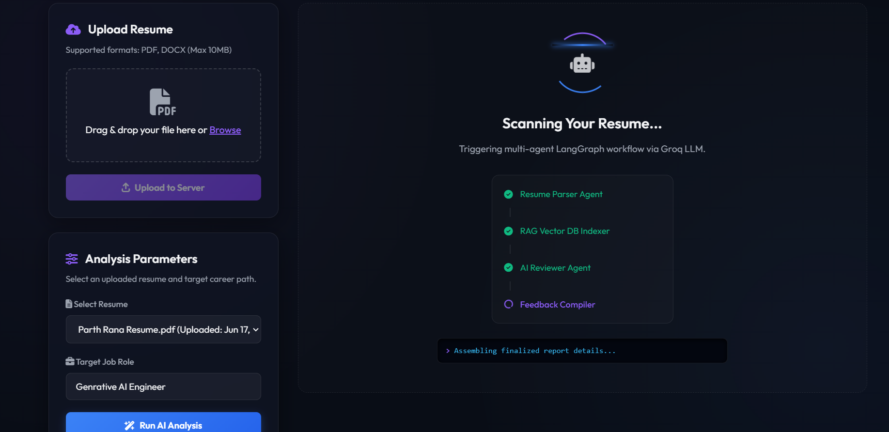
</p>

### 3. Parameters Setup (`demo/3.png`)
Allows selecting an uploaded resume from the database and typing a custom target job role.
<p align="center">
  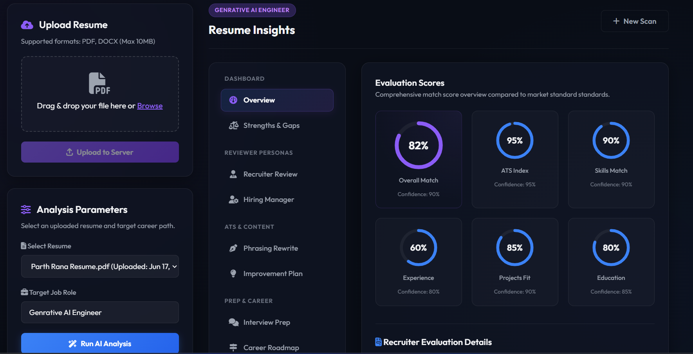
</p>

### 4. Running Multi-Agent Logs Console (`demo/4.png`)
Tracks the real-time node executions and agent status in the processing loader.
<p align="center">
  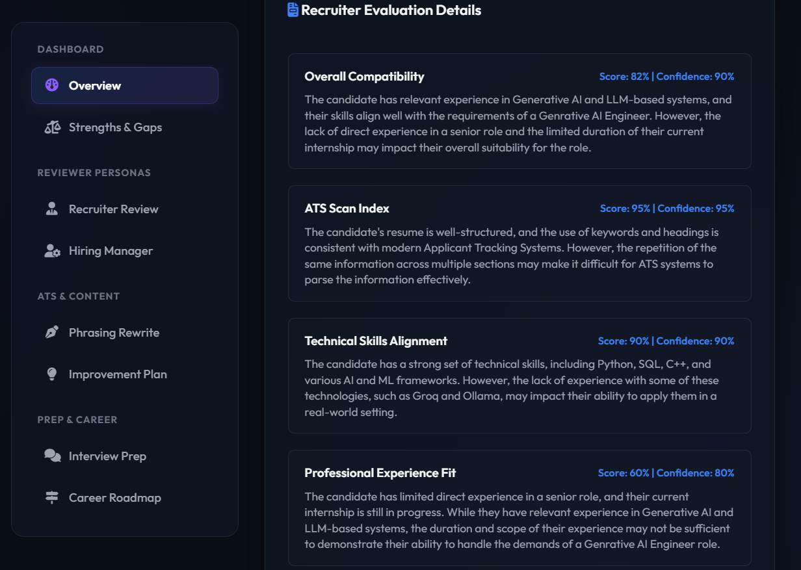
</p>

### 5. Evaluation Match Scores Dashboard (`demo/5.png`)
Circular progress metrics for Overall Match, ATS Index, Skills Match, Experience Fit, Projects Fit, and Education.
<p align="center">
  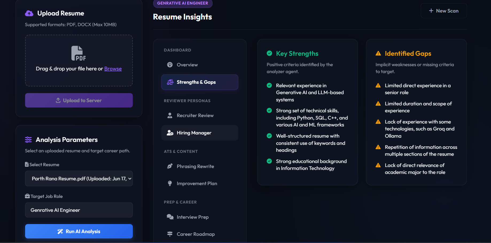
</p>

### 6. Executive Summary (`demo/6.png`)
Narrative summary showing the overall executive feedback and key strengths/gaps.
<p align="center">
  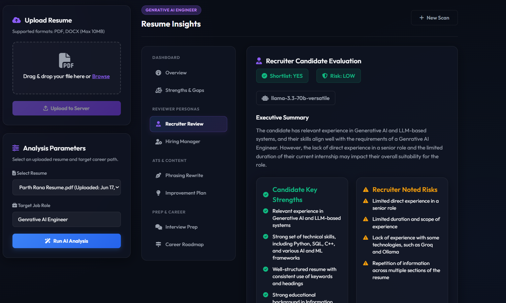
</p>

### 7. Recruiter Candidate Review (`demo/7.png`)
Displays shortlist decisions, executive recruiters summaries, and hiring risk levels.
<p align="center">
  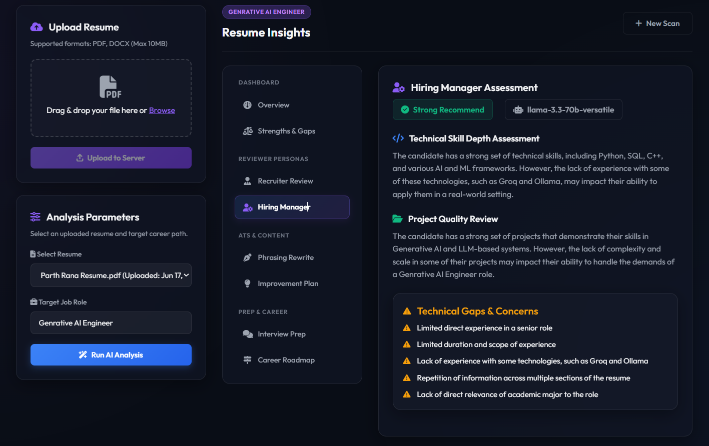
</p>

### 8. Hiring Manager Assessment (`demo/8.png`)
Highlights code quality reviews, technical depth assessment, and technical concerns.
<p align="center">
  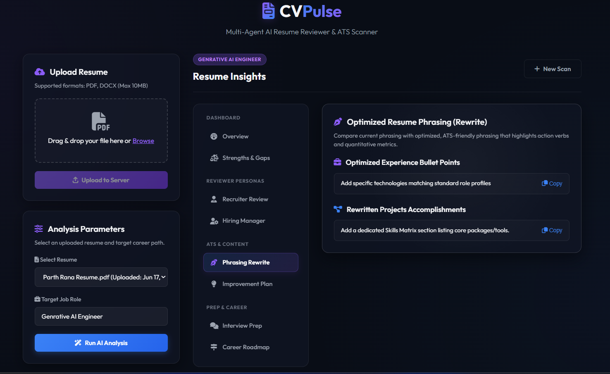
</p>

### 9. Skills Audit Cloud (`demo/9.png`)
Tag cloud displaying missing critical keywords and technologies extracted from context.
<p align="center">
  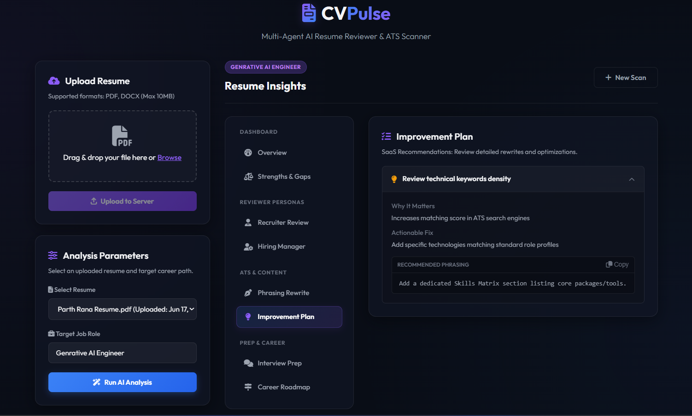
</p>

### 10. Phrasing Rewrites & Actionable Fixes (`demo/10.png`)
Copy-pasteable metrics-focused phrasing alternatives for experience bullet points.
<p align="center">
  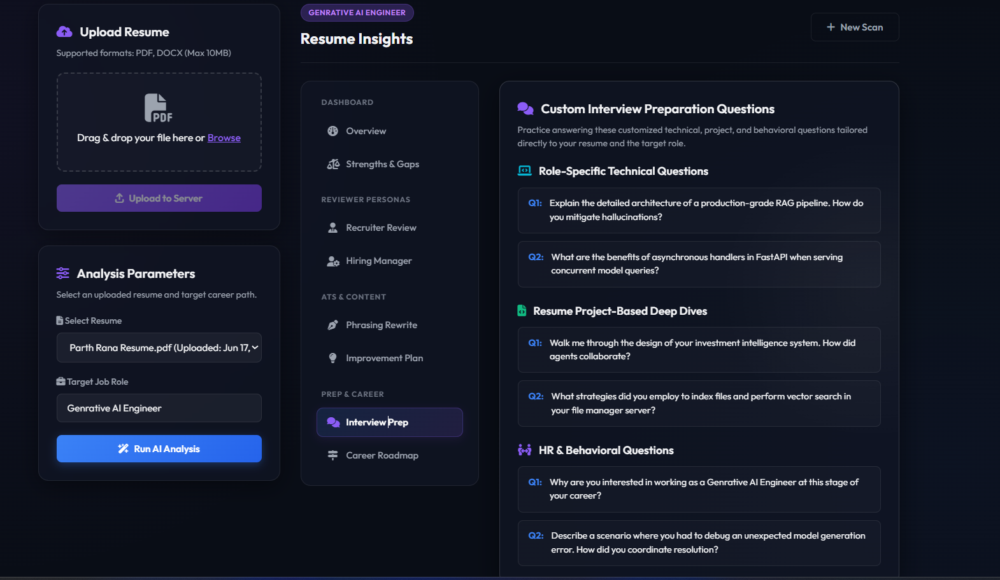
</p>

### 11. Interview Prep & Career Roadmap (`demo/11.png`)
Presents customized role-specific interview preparation questions and career milestone plans.
<p align="center">
  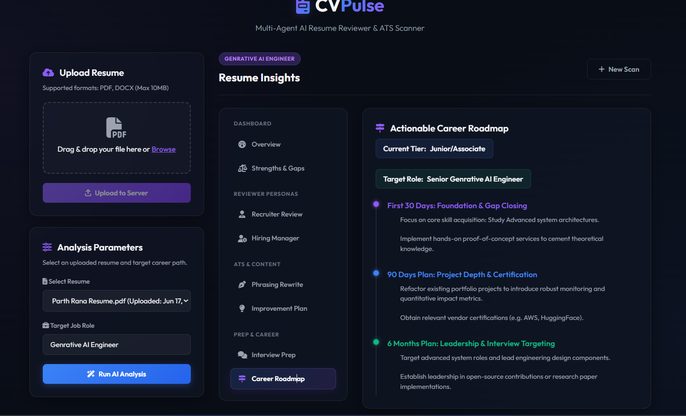
</p>

---

## 🤖 Multi-Agent Workflow

The workflow utilizes five sequential nodes defined in `backend/src/agents/graph.py`. The `Report Agent` then structures sub-agent evaluations into the final report payload:

| Node Name | Node Source File | Node Purpose | Model Used |
| :--- | :--- | :--- | :--- |
| `parse_resume` | [parser_agent.py](file:///d:/Resume%20Reviewer%20Project/ai-resume-reviewer/backend/src/agents/parser_agent.py) | Extracts text layouts and parses raw resume content. | `FAST_MODEL` (llama-3.3-70b-versatile) |
| `retrieve_chunks` | [vector_store.py](file:///d:/Resume%20Reviewer%20Project/ai-resume-reviewer/backend/src/services/vector_store.py) | Chunks text, stores vectors, and fetches job role relevant segments. | local CPU embedding model |
| `analyze_resume` | [analysis_agent.py](file:///d:/Resume%20Reviewer%20Project/ai-resume-reviewer/backend/src/agents/analysis_agent.py) | Calculates ATS, skill, project, and experience compliance scores. | `PRIMARY_MODEL` (llama-3.3-70b-versatile) |
| `generate_feedback` | [feedback_agent.py](file:///d:/Resume%20Reviewer%20Project/ai-resume-reviewer/backend/src/agents/feedback_agent.py) | Formulates gaps, missing skills, and detailed action lists. | `PRIMARY_MODEL` (llama-3.3-70b-versatile) |
| `generate_report` | [report_agent.py](file:///d:/Resume%20Reviewer%20Project/ai-resume-reviewer/backend/src/agents/report_agent.py) | Compiles all agent responses and formats sub-agent structures. | `FAST_MODEL` (llama-3.3-70b-versatile) |

---

## ⚙️ Model Routing Configuration

The models are loaded dynamically from environment variables, utilizing different routing levels:

* **Primary Model (`PRIMARY_MODEL`)**: Routed for core analytical, scoring, and persona-driven evaluations (`ats`, `recruiter`, and `hiring_manager` assessments). Defaults to `llama-3.3-70b-versatile` under Groq.
* **Fast Model (`FAST_MODEL`)**: Routed for content formatting, practicing questions, and career roadmaps (`rewrite`, `interview`, and `roadmap` evaluations). Defaults to `llama-3.3-70b-versatile` under Groq.

Model routing logic is mapped via the configuration module in [config.py](file:///d:/Resume%20Reviewer%20Project/ai-resume-reviewer/backend/src/core/config.py):
```python
def get_model(self, agent_name: str) -> str:
    primary_agents = {"ats", "recruiter", "hiring_manager"}
    if agent_name in primary_agents:
        return self.PRIMARY_MODEL
    return self.FAST_MODEL
```

---

## 🛠️ Technical Deep Dive

### 1. RAG Processing Layer
* **Text Chunking**: Document segments are divided into `500` character slices with a `100` character overlap to maintain sentence boundaries.
* **Embeddings**: Uses `sentence-transformers/all-MiniLM-L6-v2` to vectorize text chunks.
* **Vector Store**: ChromaDB manages indices locally, isolated by candidate `resume_id` to ensure absolute query segregation.

### 2. SQLite Database Schema
The database tracks state parameters across processes and stores compiled outputs:

```sql
CREATE TABLE IF NOT EXISTS resumes (
    id TEXT PRIMARY KEY,
    filename TEXT NOT NULL,
    filepath TEXT NOT NULL,
    uploaded_at TIMESTAMP DEFAULT CURRENT_TIMESTAMP
);

CREATE TABLE IF NOT EXISTS analyses (
    id TEXT PRIMARY KEY,
    resume_id TEXT NOT NULL,
    job_role TEXT NOT NULL,
    status TEXT NOT NULL, -- "processing", "completed", "failed"
    report_json TEXT,     -- Serialized AnalysisReport schema
    error_message TEXT,
    created_at TIMESTAMP DEFAULT CURRENT_TIMESTAMP,
    FOREIGN KEY (resume_id) REFERENCES resumes(id) ON DELETE CASCADE
);
```

### 3. FastAPI Web Engine
Uses asynchronous background threads to trigger the LangGraph execution pool immediately while returning a `202 ACCEPTED` status with the target analysis ID to prevent network gateway timeouts.

---

## 📊 API Reference

### 1. System Health
* **Endpoint**: `GET /health`
* **Response Payload**:
  ```json
  {
    "status": "healthy",
    "uptime_seconds": 12.34,
    "version": "1.0.0"
  }
  ```

### 2. Upload Resume
* **Endpoint**: `POST /upload-resume`
* **Request (Multipart Form)**: `file` (PDF or DOCX)
* **Response Payload (`ResumeUploadResponse`)**:
  ```json
  {
    "resume_id": "9b1deb4d-3b7d-4bad-9bdd-2b0d7b3dcb6d",
    "filename": "Darshan Resume.pdf",
    "message": "Resume uploaded and registered successfully."
  }
  ```

### 3. Retrieve Resumes List
* **Endpoint**: `GET /resumes`
* **Response Payload (`List[ResumeListItem]`)**:
  ```json
  [
    {
      "id": "9b1deb4d-3b7d-4bad-9bdd-2b0d7b3dcb6d",
      "filename": "Darshan Resume.pdf",
      "uploaded_at": "2026-06-17 14:02:15"
    }
  ]
  ```

### 4. Trigger Analysis
* **Endpoint**: `POST /analyze-resume`
* **Request Body (`AnalysisRequest`)**:
  ```json
  {
    "resume_id": "9b1deb4d-3b7d-4bad-9bdd-2b0d7b3dcb6d",
    "job_role": "GenAI Engineer"
  }
  ```
* **Response Payload (`AnalysisStatusResponse`)**:
  ```json
  {
    "analysis_id": "f3b3924c-9f8d-4ad1-b220-410a8839cb8a",
    "resume_id": "9b1deb4d-3b7d-4bad-9bdd-2b0d7b3dcb6d",
    "job_role": "GenAI Engineer",
    "status": "processing"
  }
  ```

### 5. Fetch Status or Report
* **Endpoint**: `GET /analysis/{analysis_id}`
* **Response Payload (`AnalysisStatusResponse`)**:
  ```json
  {
    "analysis_id": "f3b3924c-9f8d-4ad1-b220-410a8839cb8a",
    "resume_id": "9b1deb4d-3b7d-4bad-9bdd-2b0d7b3dcb6d",
    "job_role": "GenAI Engineer",
    "status": "completed",
    "report": {
      "job_role": "GenAI Engineer",
      "overall_score": 82,
      "overall_confidence": 0.85,
      "overall_explanation": "Detailed match scoring summary text...",
      "ats_score": 78,
      "skills_score": 85,
      "experience_score": 80,
      "project_score": 83,
      "education_score": 78,
      "ats": {
        "model_used": "llama-3.3-70b-versatile",
        "agent_name": "ats",
        "timestamp": "2026-06-17T09:13:34Z",
        "processing_time_ms": 1200,
        "confidence_score": 0.85,
        "ats_score": 78,
        "skills_score": 85,
        "experience_score": 80,
        "project_score": 83,
        "education_score": 78,
        "overall_score": 82,
        "reasoning": "ATS compatibility comments...",
        "strengths": ["Strong keywords density"],
        "weaknesses": ["Multi-column elements detected"]
      },
      "recruiter": {
        "model_used": "llama-3.3-70b-versatile",
        "agent_name": "recruiter",
        "timestamp": "2026-06-17T09:13:34Z",
        "processing_time_ms": 1100,
        "confidence_score": 0.85,
        "shortlist_decision": true,
        "recruiter_summary": "Recruiter profile review...",
        "strengths": ["Clear metrics"],
        "weaknesses": ["Deployment toolings gap"],
        "hiring_risk_level": "low"
      },
      "hiring_manager": {
        "model_used": "llama-3.3-70b-versatile",
        "agent_name": "hiring_manager",
        "timestamp": "2026-06-17T09:13:34Z",
        "processing_time_ms": 950,
        "confidence_score": 0.85,
        "interview_recommendation": "Strong Recommend",
        "technical_concerns": ["Verify cloud scaling"],
        "project_quality_review": "HM quality comments...",
        "skill_depth_assessment": "HM depth comments..."
      },
      "rewrite": {
        "model_used": "llama-3.3-70b-versatile",
        "agent_name": "rewrite",
        "timestamp": "2026-06-17T09:13:34Z",
        "processing_time_ms": 800,
        "confidence_score": 0.85,
        "optimized_bullets": ["Achieved X by doing Y"],
        "rewritten_projects": ["Engineered A using B"],
        "rewritten_experience": ["Led team doing C"]
      },
      "interview": {
        "model_used": "llama-3.3-70b-versatile",
        "agent_name": "interview",
        "timestamp": "2026-06-17T09:13:34Z",
        "processing_time_ms": 750,
        "confidence_score": 0.85,
        "technical_questions": ["Technical practice questions..."],
        "project_based_questions": ["Project deep dive questions..."],
        "hr_questions": ["HR behavioral questions..."]
      },
      "roadmap": {
        "model_used": "llama-3.3-70b-versatile",
        "agent_name": "roadmap",
        "timestamp": "2026-06-17T09:13:34Z",
        "processing_time_ms": 900,
        "confidence_score": 0.85,
        "current_level": "Mid-Level Professional",
        "next_target_role": "Senior GenAI Engineer",
        "missing_skills": ["Kubernetes", "Triton"],
        "roadmap_30d": ["milestone 1"],
        "roadmap_90d": ["milestone 2"],
        "roadmap_6m": ["milestone 3"]
      },
      "strengths": ["Key strength list item..."],
      "weaknesses": ["Gaps list item..."],
      "missing_skills": ["Missing keyword item..."],
      "recommendations": [
        {
          "issue": "Specific resume weakness description...",
          "why_it_matter": "Explanation of ATS impact...",
          "improvement": "Actionable optimization suggestion...",
          "example_content": "Before vs After rewrite example..."
        }
      ],
      "final_feedback": "General feedback summary comments..."
    },
    "error": null
  }
  ```

---

## 📂 Repository Structure

```text
ai-resume-reviewer/
├── backend/
│   ├── src/
│   │   ├── agents/         # LangGraph Node Handlers (Graph, Parser, Analysis, Feedback, Report)
│   │   ├── core/           # Config setups, Database initializations, Logger wrappers
│   │   ├── models/         # SQLite tables CRUD functions
│   │   ├── prompts/        # System and agent template prompts
│   │   ├── routers/        # API Controller endpoints (health, resume, analysis)
│   │   ├── schemas/        # Type-safe validation Pydantic schemas
│   │   ├── services/       # Vector Store / RAG indexing integrations
│   │   ├── utils/          # File parsing helpers (PDF/DOCX readers)
│   │   └── main.py         # FastAPI App Entrypoint
│   │
│   ├── uploads/            # File system cache for user uploads
│   ├── vectorstore/        # SQLite DB and ChromaDB data directories
│   ├── requirements.txt    # Python PIP requirements
│   └── .env.example        # Environment variables configuration template
│
├── frontend/
│   ├── app.js              # State Controller, API Polling, and SVG progress animations
│   ├── index.html          # Clean structure layout
│   └── style.css           # Glassmorphic Dark UI stylesheets
│
├── demo/                   # Actual UI screenshots for project showcasing
└── README.md               # Premium Developer Documentation
```

---

## 🚀 Operations Guide

### 1. Prerequisites
* **Python 3.10+** installed on your system.
* An active **Groq API Key** (you can create one via the [Groq Console](https://console.groq.com/)).

### 2. Install Backend Dependencies
1. Navigate to the backend directory:
   ```bash
   cd backend
   ```
2. Create and activate a virtual environment:
   * **Windows (PowerShell)**:
     ```powershell
     python -m venv venv_resume
     .\venv_resume\Scripts\Activate.ps1
     ```
   * **macOS/Linux**:
     ```bash
     python3 -m venv venv_resume
     source venv_resume/bin/activate
     ```
3. Install Python dependencies:
   ```bash
   pip install -r requirements.txt
   ```
4. Configure `.env` file based on `.env.example` inside the `backend` folder:
   ```env
   GROQ_API_KEY=gsk_your_groq_api_key_here
   PRIMARY_MODEL=llama-3.3-70b-versatile
   FAST_MODEL=llama-3.3-70b-versatile
   ```
5. Run the FastAPI development server:
   ```bash
   python -m uvicorn src.main:app --reload
   ```

### 3. Open Frontend Interface
FastAPI mounts the frontend static directory automatically.
* Open your browser and go to: **`http://127.0.0.1:8000`**

---

## 📝 License

Distributed under the MIT License. See `LICENSE` for more information.